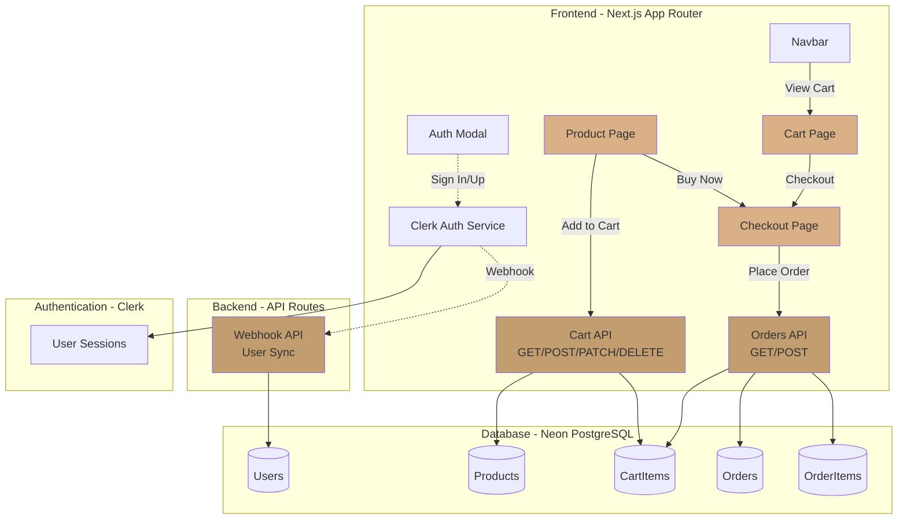
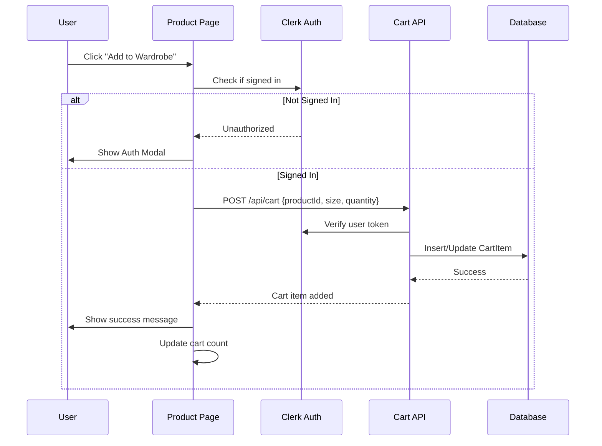
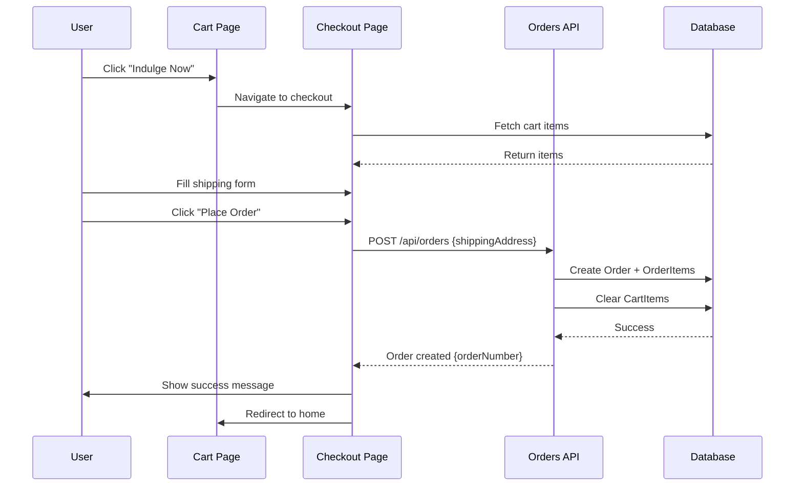
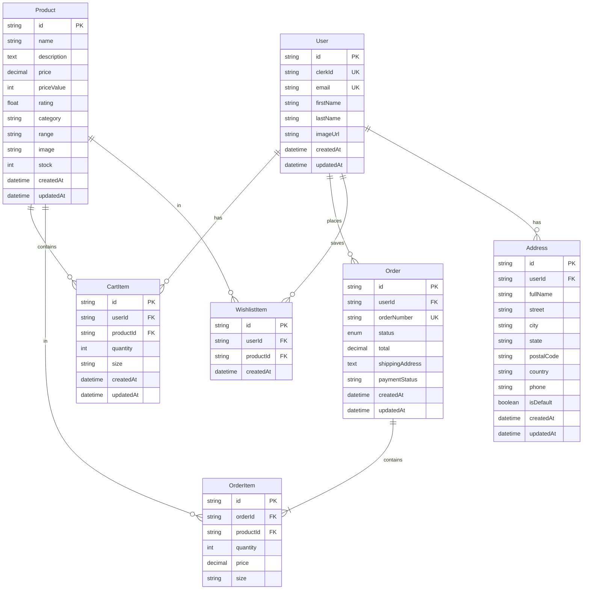
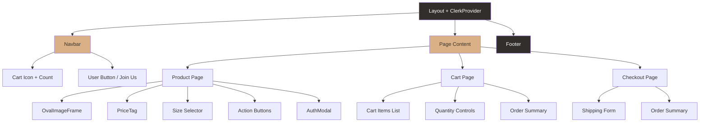
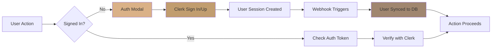
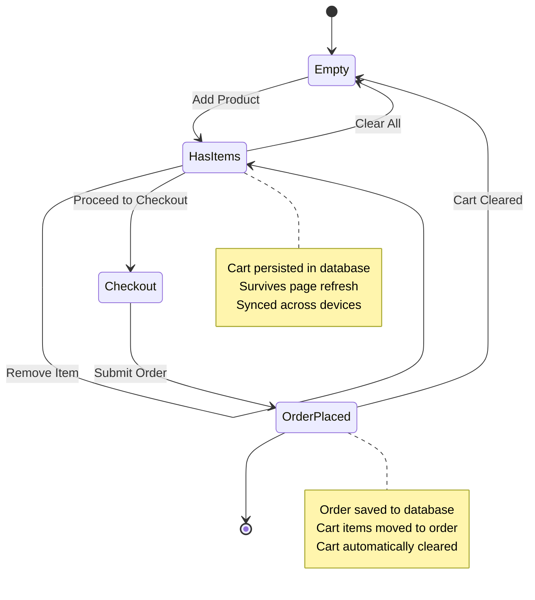
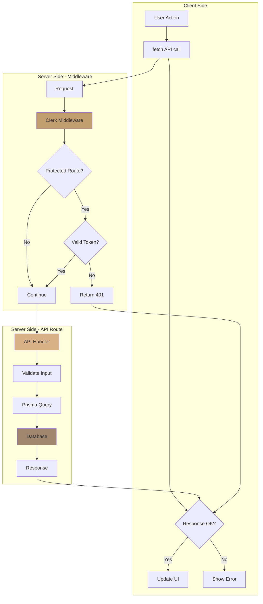
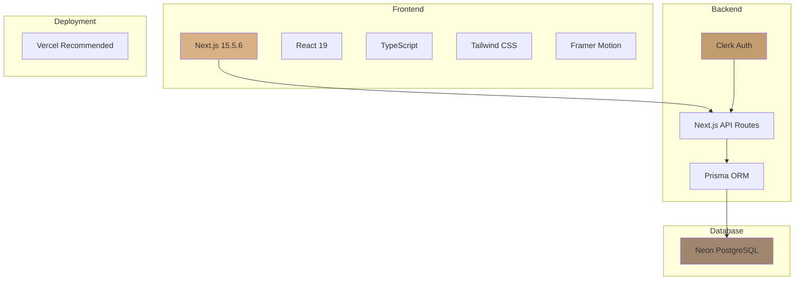

# 🗺️ E-Commerce System Architecture

## System Overview



## Data Flow

### Adding to Cart


### Checkout Process


## Database Schema



## Component Hierarchy



## Authentication Flow



## Cart State Management



## API Request/Response Flow



## File Structure

```
my-app/
├── prisma/
│   ├── schema.prisma          # Database schema
│   └── seed.ts                # Product seeding script
├── src/
│   ├── app/
│   │   ├── api/
│   │   │   ├── cart/
│   │   │   │   └── route.ts   # Cart CRUD
│   │   │   ├── orders/
│   │   │   │   └── route.ts   # Order management
│   │   │   └── webhooks/
│   │   │       └── clerk/
│   │   │           └── route.ts # User sync
│   │   ├── cart/
│   │   │   └── page.tsx       # Cart page
│   │   ├── checkout/
│   │   │   └── page.tsx       # Checkout page
│   │   ├── product/[id]/
│   │   │   └── page.tsx       # Product detail
│   │   └── layout.tsx         # Root layout
│   ├── _components/
│   │   ├── AuthModal.tsx      # Auth prompt
│   │   ├── Navbar.tsx         # Navigation + cart
│   │   └── ...
│   ├── data/
│   │   └── products.js        # Product data
│   ├── lib/
│   │   └── prisma.ts          # Prisma client
│   └── middleware.ts          # Auth middleware
├── .env.local                 # Environment variables
├── CART-SETUP-GUIDE.md        # Setup guide
└── README-CART-SUMMARY.md     # This summary
```

## Technology Stack



---

This architecture provides:
- 🔐 Secure authentication
- 💾 Persistent data storage
- 🛒 Real-time cart updates
- 📱 Responsive design
- ⚡ Fast performance
- 🎨 Beautiful UI
